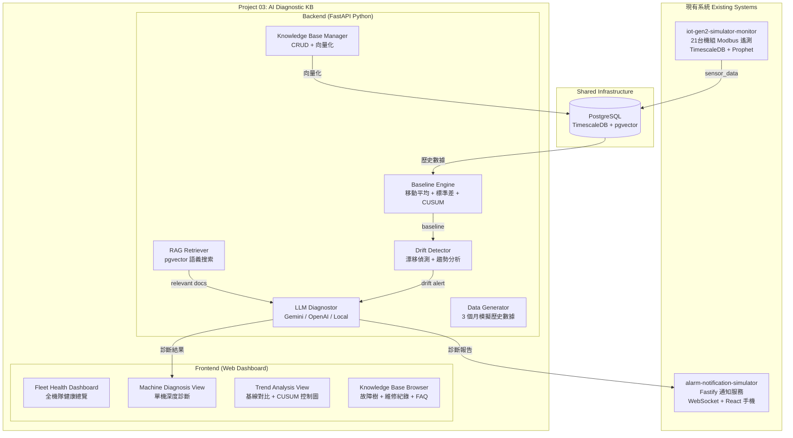

# AI Diagnostic Knowledge Base — Project 03 完整實施計畫 / Implementation Plan

> **專案代碼 Project ID**: `03`
> **顯示名稱 Label**: `AI DIAGNOSTIC KB`
> **資料夾 Slug**: `ai-diagnostic-kb`
> **狀態 Status**: 實施完成 / Fully Implemented

---

## 1. 背景與系統定位 / Background & Architecture Placement

基於對 `iot-gen2-simulator-monitor` 和 `alarm-notification-simulator` 的深度分析，建立一個全新的 **AI 智慧診斷知識庫平台**，作為 st8925lab 的 Project 03。

### 痛點與解決方案
1. **只有閾值告警，無漸進漂移預警** → 引入移動平均基準線 + 雙向 Tabular CUSUM 累積和控制圖。
2. **告警只報異常，不給原因與解法** → 結合 pgvector 語義檢索與 Gemini LLM 進行根因診斷與處置推薦。
3. **維運知識散落** → 建立涵蓋故障樹、工單、FAQ、零件壽命的結構化知識庫。

---

## 2. 系統架構圖 / Architecture Diagram

---

## 3. 實施階段與成果 / Implementation Phases & Milestones

| Phase | 工作內容 | 完成狀態 |
|---|---|---|
| **P0** | 資料夾原子改名 (`ai-diagnostic-kb`) + `config.js` 更新 + `render.yaml` 部署配置 + 全站 `verify.py` 驗證 | ✅ 完成 |
| **P1** | 資料庫 DDL (`04_ai_diagnostic_kb.sql`) + 知識庫種子資料 (15 故障樹, 20 工單, 30 FAQ, 12 零件) | ✅ 完成 |
| **P2** | FastAPI 後端架構 + Baseline Engine + CUSUM 演算法 + 漂移檢測器 + REST 路由 | ✅ 完成 |
| **P3** | LLM Provider 抽象層 (Gemini 1.5/2.0, OpenAI, 本地專家) + RAG 檢索 + AI 診斷引擎 | ✅ 完成 |
| **P4** | 3 個月歷史時序數據產生器 (含冷凝器結垢、冷媒洩漏、蒸發器結垢情境) | ✅ 完成 |
| **P5** | 前端全機隊健康總覽 (Dashboard) + 單機深度 AI 診斷儀表板 | ✅ 完成 |
| **P6** | 前端多維趨勢與 CUSUM 控制圖 + 知識庫即時語義檢索瀏覽器 | ✅ 完成 |
| **P7** | 整合測試 (`test_backend.py` 通過) + 全站幾何與配色驗證 (`verify.py` 通過) | ✅ 完成 |
