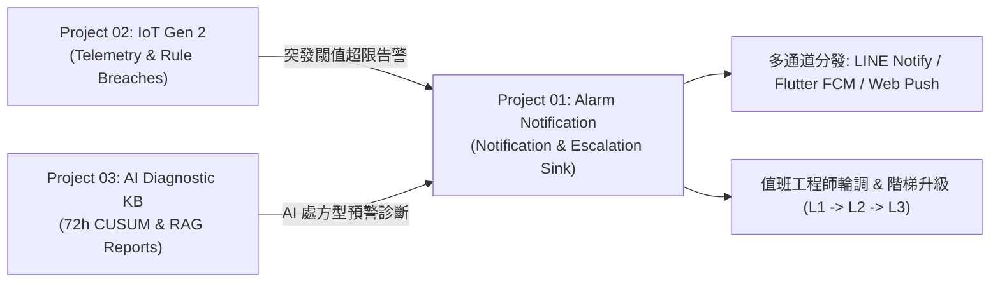

# Project 01 — 告警通知模擬台開發紀錄 / Alarm Notification Simulator Development Log

本檔記錄 `alarm-notification-simulator/`（`config.js` 內 `id: '01'`）這個子頁面**自己的**變更歷史與架構定位。
整站共用的架構決策（軌道、星雲爆炸、色相傳遞機制、共用站名元件等）記錄在根目錄的 [`../README.md`](../README.md) 與 [`../PROMPT.md`](../PROMPT.md)。
生產級獨立部署指南請參閱根目錄 [`../VPS_DEPLOYMENT_GUIDE.md`](../VPS_DEPLOYMENT_GUIDE.md)。

This file records the local change history, architecture positioning, and triad integration for `alarm-notification-simulator/` (`id: '01'` in `config.js`). Site-wide decisions live in [`../README.md`](../README.md) and [`../PROMPT.md`](../PROMPT.md). For VPS deployment, see [`../VPS_DEPLOYMENT_GUIDE.md`](../VPS_DEPLOYMENT_GUIDE.md).

---

## 1. 本頁身份 / Identity

| 項目 Item | 值 Value |
|---|---|
| 內部代碼 Internal id | `01`（永不變動 / never changes）|
| 顯示名稱 Display label | `ALARM NOTIFICATION SIMULATOR`（取自 `config.js` 的 `PROJECTS[0].label`）|
| 資料夾／URL Slug | `alarm-notification-simulator`（**必須**與 label 同步改名，見「命名同步規則」）|
| 軌道顏色 Ring colour | 由首頁彩虹配色第 1 環決定，隨機洗牌；本頁頂列下緣的色線與此同步 |
| 實作形式 Implementation | **React 18 / Vite 應用程式編譯產物**（整合全站共用毛玻璃頂列與色相交接機制） |

---

## 2. 這是什麼 / What this page is

這是「行動告警推播與排班升級系統」（Mobile Alarm Notification System — Phase A Simulation Platform）的**模擬控制台前端**。
原始開發於獨立專案 `12_App_notification`。在 ST8925 LAB 宇宙中，點擊 PROJECT 01 開啟的就是真正可互動的告警模擬平台本身。

完整的產品定義、架構決策與歷史修復記錄在 [`source/README.md`](source/README.md) 與 [`source/PROMPT.md`](source/PROMPT.md)。

---

## 3. 三大專案協同互聯生態系 / The 3-Project Triad Ecosystem

本系統在 ST8925 LAB 扮演**告警通知與排班升級執行終端 (Notification & Escalation Sink)**，與 P02 及 P03 構成閉環：



### 頂部導覽列一鍵跨專案跳轉 / Cross-Project Navigation
頂部導覽列右側配置一鍵跨專案切換按鈕：
- `📡 IoT 遙測 (P02)` ➔ `../iot-gen2-simulator-monitor/index.html`
- `🤖 AI 診斷 (P03)` ➔ `../ai-diagnostic-kb/index.html`
- `&larr; BACK TO ORBIT` ➔ `../index.html` (回到首頁宇宙軌道)

---

## 4. 21 台實體機組選擇器與動態遙測綁定 / 21-Machine Fleet Selector & Dynamic Binding

為達成全站跨專案一致之操作體驗與展示完整性，本系統頂部整合了與 P02/P03 完全同步的 **21 台實體機組下拉選單 (`device-switcher-bar`)**：

### 4.1 機組清單共享 / Shared Fleet Definition
- 定義於 `source/apps/web/src/constants/fleet.ts`，收錄 8 大客戶端（內湖生技、中榮分院、信義總部、竹科六廠、高榮醫中、南港生技、桃園精密、綠能園區）共 21 台實體冰水機與冷卻水塔。
- 預設選擇 `15. 內湖生技-西側1號主機 (ECO-CH-01)`。

### 4.2 動態遙測與情境綁定 / Dynamic Telemetry & Scenario Binding
1. **Panel ① 感測器面板 (Sensor Panel)**：
   - 根據所選設備類型（Chiller 冰水主機 vs Tower 冷卻水塔）自動切換遙測指標名稱與單位（冰水機顯示冰水出水溫/冷媒高壓；水塔顯示冷卻水出水溫/風機負載）。
   - 感測器右下角即時顯示所選機組 SN（如 `ECO-CH-01`, `ECO-CT-01`）。
   - 寫入客戶端資料庫 `source_alarm_events` 時攜帶該機組標籤。
2. **Panel ② 直接觸發情境 (Trigger Console)**：
   - 在情境標題與告警預覽中動態注入所選機組之 `[SN]`、`客戶名稱` 與 `型號`。
   - 模擬直接觸發時，推播訊息與不可篡改日誌均具備該特定機組之真實身份。

---

## 5. 架構上的取捨 / Architectural Trade-offs

st8925lab.com 為純靜態站（Cloudflare Pages）。告警模擬台需要 Fastify API、模擬營運伺服器、WebSocket 與 SQLite 資料庫：

| 部分 Part | 放置位置 Where | 說明 Notes |
|---|---|---|
| 前端 Frontend (`apps/web`) | **這裡** (`index.html` + `assets/`) | 隨 st8925lab.com (Cloudflare Pages) 一起發布 |
| 後端 Backend (`apps/api` + `apps/ops-server`) | **Render.com 免費方案** / **VPS 容器化** | 部署設定見根目錄 [`../render.yaml`](../render.yaml) 與 [`../VPS_DEPLOYMENT_GUIDE.md`](../VPS_DEPLOYMENT_GUIDE.md) |
| 原始碼 Source | `source/` 子資料夾 | Git 追蹤但透過 `.assetsignore` 排除隨靜態站發布 |

**後端網址（寫死於前端 build）：**
- API: `https://st8925lab-alarm-api.onrender.com`
- Ops-server: `https://st8925lab-alarm-ops.onrender.com`

---

## 5. 如何重建前端 / How to rebuild the frontend

```bash
python tools/build_alarm_frontend.py
```
腳本流程：
1. 以 `--ignore-scripts` 安裝依賴（跳過 `apps/api` 的原生編譯）。
2. 執行 `vite build --base=/alarm-notification-simulator/`。
3. 自動將全站共用毛玻璃頂列、Wordmark 與色相交接邏輯注入 `index.html`。
4. 複製 `dist/` 產物至本目錄覆蓋 `index.html` 與 `assets/`。

---

## 6. 命名同步規則 / Folder-Rename-on-Label-Change Rule

若修改 `config.js` 中的 `label`，必須執行：
```bash
python tools/rename_project.py 01 "新的顯示名稱"
```
同步更新資料夾、`config.js` 的 `slug`，並執行 `python verify.py` 驗證全站一致性。

---

## 7. 變更歷史 / Change History

| 日期 Date | 變更項目 Change | 說明 Notes |
|---|---|---|
| 2026-08-09 | 建立本資料夾 (Folder Created) | 全站架構由單一動態頁改為實體獨立資料夾，初始化樣板。 |
| 2026-08-13 | **改建為告警通知模擬台 Rebuilt as Alarm Notification Simulator** | 引入 `12_App_notification` 完整 Vite 前端與 Render 後端部署藍圖 (`render.yaml`)。 |
| 2026-08-18 | **三大專案互聯與頂部 Cross-Nav 整合 3-Project Triad Integration** | 頂部導覽列整合 P02 (IoT 遙測) 與 P03 (AI 智慧診斷) 雙向導航按鈕；確立作為全站告警與 AI 診斷派送終端之架構定位。 |
| 2026-08-18 | **21 台實體機組選擇器整合 21-Machine Fleet Selector Integration** | 依據 `/grill-me` 訪談，新增與 P02/P03 一致之頂置設備切換橫幅 (`device-switcher-bar`)，感測器滑桿、SN 標籤與直接觸發 Webhook 情境全面動態綁定所選機組。 |

*(未來每次修改本頁，請在此表新增一列，附日期與說明。)*

