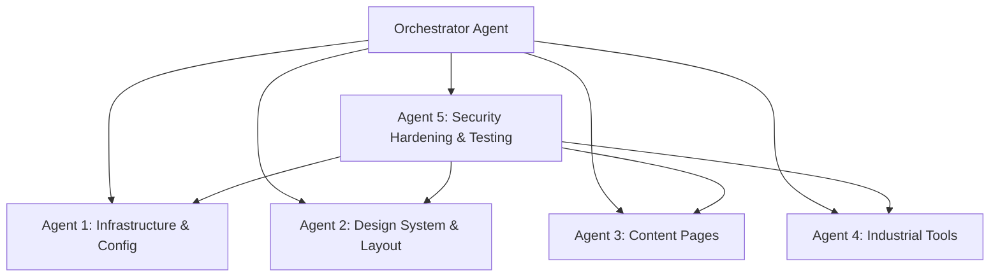

# Option A — Full Astro SSG Build: Implementation Plan

## Confirmed Decisions
- **Path**: `d:\st8925lab\cloudmd\option_A\`
- **Existing React site**: Kept as-is (separate project)
- **Case study gaps**: Write realistic placeholder content, mark with `[GAP]`
- **Deployment**: Build deployment-ready (manual deploy by user)
- **Bilingual**: Full i18n (en/zh) from the start

---

## Multi-Agent Architecture (5 Workstreams)



| Agent | Responsibility | Key Outputs |
| :--- | :--- | :--- |
| **Agent 1** | Astro scaffold, Tailwind config, i18n routing, Cloudflare Pages config, build scripts | `astro.config.mjs`, `package.json`, `wrangler.toml`, CI/CD config |
| **Agent 2** | Design tokens, layout components, responsive nav, footer, card system | `tokens.css`, `BaseLayout.astro`, `Navbar.astro`, `Footer.astro` |
| **Agent 3** | Homepage, Case Study, Reference, Capabilities, About pages (en/zh) | All `.astro` + `.md` content files |
| **Agent 4** | Modbus Address Converter, Float Decoder (interactive islands) | Tool components + static examples |
| **Agent 5** | CSP headers, input sanitization, dependency audit, build verification, security report | `_headers` file, security test scripts, audit report |

---

## Proposed Changes

### Agent 1: Infrastructure & Configuration

#### [NEW] `package.json`
- Astro 4.x, `@astrojs/tailwind`, `@astrojs/sitemap`, `@astrojs/cloudflare`
- Build scripts: `dev`, `build`, `preview`
- Zero unnecessary dependencies

#### [NEW] `astro.config.mjs`
- SSG output (`output: 'static'`)
- i18n config with `en` default + `zh` locale
- Sitemap integration
- Tailwind integration
- `site: 'https://st8925lab.com'`

#### [NEW] `tailwind.config.mjs`
- Design tokens as CSS variables
- Custom color palette (blue/gold/dark)
- Font families: Inter, IBM Plex Sans, Noto Sans TC

#### [NEW] `public/robots.txt`
- Allow GPTBot, ClaudeBot, PerplexityBot
- Block Zone B/C paths

#### [NEW] `public/llms.txt`
- Site summary for AI agents

#### [NEW] `public/_headers`
- CSP, X-Frame-Options, X-Content-Type-Options, Referrer-Policy
- Permissions-Policy (disable camera, mic, geolocation)

---

### Agent 2: Design System & Layouts

#### [NEW] `src/styles/tokens.css`
```css
--bg: #0A0E14; --surface: #131A24;
--blue: #2563EB; --blue-deep: #0F2A47;
--gold: #C9A227; --text: #E6EDF5; --text-dim: #8B98A9;
```

#### [NEW] `src/layouts/BaseLayout.astro`
- HTML shell with proper `<head>` (meta, OG, JSON-LD, hreflang)
- Font loading with `font-display: swap`
- Language switcher support

#### [NEW] `src/components/Navbar.astro`
- 5-section nav: Work · Reference · Tools · Capabilities · About
- Active state highlighting
- Language toggle (EN/中文)
- Mobile hamburger menu
- Contact CTA button

#### [NEW] `src/components/Footer.astro`
- Site map links, copyright, social links
- Built with Astro / Hosted on Cloudflare badge

#### [NEW] `src/components/CaseStudyCard.astro`
- Meta bar (Sector, Role, Duration, Stack)
- 3-4 result chips with quantified metrics
- 2-3 sentence summary

#### [NEW] `src/components/ContactCTA.astro`
- Floating/fixed contact button

---

### Agent 3: Content Pages (Bilingual)

#### [NEW] Homepage (`src/pages/en/index.astro` + `src/pages/zh/index.astro`)
- Professional hero: "OT/IT Integration Specialist" with tagline
- 3-4 quantified highlights (result chips)
- Featured case study card
- Capabilities summary grid
- Cross-links to Reference and Tools

#### [NEW] Work / Case Studies
- `src/content/work/en/chiller-ot-monitoring.md`
- `src/content/work/zh/chiller-ot-monitoring.md`
- 8-section structure (Context → Problem → Options → Build → Hard Part → Outcome → Reflection → Role)

#### [NEW] Reference
- `src/content/reference/en/modbus-pdu-offset-errors.md`
- `src/content/reference/en/modbus-float-assembly.md`
- Chinese equivalents under `zh/`

#### [NEW] Capabilities Page
- 5 buyer-language service descriptions
- OT/IT integration, protocol bridging, monitoring deployment, specs audit, delivery docs

#### [NEW] About Page
- Professional positioning statement
- Verifiable credentials
- Contact form / CTA

---

### Agent 4: Industrial Tools (Interactive Islands)

#### [NEW] Modbus Address Converter (`src/components/tools/ModbusAddressConverter.astro`)
- Table ↔ PDU Offset ↔ Vendor convention converter
- 3+ pre-rendered static HTML examples (SEO)
- Interactive calculator loaded via `client:visible`
- Input validation (prevent XSS, injection)

#### [NEW] Modbus Float Decoder (`src/components/tools/ModbusFloatDecoder.astro`)
- Input: 4 hex registers
- Output: 4 word/byte order variant decodings
- Static examples table
- Client-side only (zero outbound connections)
- Input sanitization

#### [NEW] Tools landing page
- Card grid linking to each tool
- SoftwareApplication JSON-LD schema

---

### Agent 5: Security Hardening & Testing

#### Security Headers (`public/_headers`)
```
Content-Security-Policy: default-src 'self'; script-src 'self'; style-src 'self' 'unsafe-inline' https://fonts.googleapis.com; font-src 'self' https://fonts.gstatic.com; img-src 'self' data:; connect-src 'self'; frame-ancestors 'none'
X-Frame-Options: DENY
X-Content-Type-Options: nosniff
Referrer-Policy: strict-origin-when-cross-origin
Permissions-Policy: camera=(), microphone=(), geolocation=()
X-XSS-Protection: 1; mode=block
```

#### Security Testing Checklist
- [ ] **XSS Prevention**: All tool inputs sanitized; no `innerHTML`; CSP blocks inline scripts
- [ ] **Dependency Audit**: `npm audit` with zero high/critical vulnerabilities
- [ ] **Secret Scanning**: No API keys, tokens, or passwords in codebase
- [ ] **HTML Injection**: All user-facing text escaped; Astro auto-escapes by default
- [ ] **HTTPS Enforcement**: Cloudflare auto-redirects HTTP → HTTPS
- [ ] **Subresource Integrity**: External font/script resources use SRI hashes where applicable
- [ ] **Build Verification**: `npm run build` succeeds with zero errors/warnings
- [ ] **Lighthouse Audit**: Performance > 90, Accessibility > 90, Best Practices > 90, SEO > 90
- [ ] **robots.txt Verification**: Private paths blocked, AI bots allowed for public content
- [ ] **No Open Redirects**: No dynamic URL redirects based on user input
- [ ] **EXIF Stripping**: Any images included have GPS/camera metadata removed
- [ ] **JSON-LD Validation**: Structured data validates against Google Rich Results Test

---

## File Structure

```
d:\st8925lab\cloudmd\option_A\
├── astro.config.mjs
├── package.json
├── tailwind.config.mjs
├── tsconfig.json
├── wrangler.toml              # Cloudflare Pages config
├── README.md                  # English
├── README_zh.md               # 中文
├── public/
│   ├── robots.txt
│   ├── llms.txt
│   ├── _headers               # Security headers
│   └── favicon.svg
├── src/
│   ├── styles/
│   │   └── tokens.css         # Design system tokens
│   ├── layouts/
│   │   └── BaseLayout.astro   # HTML shell + head
│   ├── components/
│   │   ├── Navbar.astro
│   │   ├── Footer.astro
│   │   ├── CaseStudyCard.astro
│   │   ├── ContactCTA.astro
│   │   ├── LanguageSwitcher.astro
│   │   └── tools/
│   │       ├── ModbusAddressConverter.astro
│   │       └── ModbusFloatDecoder.astro
│   ├── content/
│   │   ├── config.ts          # Content Collections schema
│   │   ├── work/
│   │   │   ├── en/chiller-ot-monitoring.md
│   │   │   └── zh/chiller-ot-monitoring.md
│   │   └── reference/
│   │       ├── en/modbus-pdu-offset.md
│   │       ├── en/modbus-float-assembly.md
│   │       ├── zh/modbus-pdu-offset.md
│   │       └── zh/modbus-float-assembly.md
│   ├── pages/
│   │   ├── index.astro        # Redirect to /en/
│   │   ├── en/
│   │   │   ├── index.astro    # English homepage
│   │   │   ├── work/
│   │   │   │   ├── index.astro
│   │   │   │   └── [...slug].astro
│   │   │   ├── reference/
│   │   │   │   ├── index.astro
│   │   │   │   └── [...slug].astro
│   │   │   ├── tools/
│   │   │   │   ├── index.astro
│   │   │   │   ├── modbus-address-converter.astro
│   │   │   │   └── modbus-float-decoder.astro
│   │   │   ├── capabilities.astro
│   │   │   └── about.astro
│   │   └── zh/
│   │       └── (mirrors /en/ structure)
│   └── i18n/
│       ├── en.json            # English UI strings
│       └── zh.json            # Chinese UI strings
└── reports/
    ├── completion_report_en.md
    └── completion_report_zh.md
```

---

## Verification Plan

### Automated Tests
```bash
npm run build          # Zero errors/warnings
npm audit              # Zero high/critical vulnerabilities
npx astro check        # TypeScript + Astro validation
```

### Manual Verification
- All pages render correctly in browser (`npm run preview`)
- Language switcher toggles between en/zh on all pages
- Modbus tools produce correct calculations
- Mobile responsive layout works on 375px–1440px
- All links functional (no 404s)
- JSON-LD validates via Google Rich Results Test
- Security headers present in response

### Security Verification
- CSP blocks inline script injection attempts
- Tool inputs reject malicious payloads (XSS vectors)
- No secrets in codebase (`grep -r "api_key\|token\|password\|secret"`)
- `npm audit` clean
- robots.txt properly restricts private paths

---

## Deliverables Summary

| # | Deliverable | Language |
| :--- | :--- | :--- |
| 1 | Complete Astro SSG project (deployment-ready) | — |
| 2 | README.md | English |
| 3 | README_zh.md | 中文 |
| 4 | Completion Report | English + 中文 |
| 5 | All pages bilingual (en/zh) | English + 中文 |
| 6 | Security audit results | English |
| 7 | 2 industrial Modbus tools | — |
| 8 | 1 case study (Chiller OT Monitoring) | English + 中文 |
| 9 | 2 reference articles | English + 中文 |

> [!IMPORTANT]
> Approve this plan to begin multi-agent execution. Estimated time: 20-30 minutes for full build + testing.
