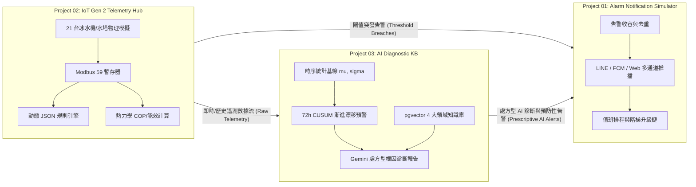

# ST8925 LAB — Project 02: Wayne IoT Server Gen 2 (Simulation, Production Console & Triad Hub)

> **Project ID**: `02`  
> **Display Label**: `IOT GEN2 SIMULATOR & MONITOR`  
> **Folder / Slug**: `iot-gen2-simulator-monitor`  
> **Live LAB URL**: `https://st8925lab.com/iot-gen2-simulator-monitor/`  
> **Production VPS Blueprint**: `iot-gen2-simulator-monitor/vps/`  
> **Status**: 生產級模擬展示 (LAB Staging) & VPS 部署套件就緒 / Live on LAB & VPS Blueprint Ready

---

## 1. 專案概述 / Overview

### 中文
本專案為 **Wayne IoT Server Gen 2 (第二代工業物聯網架構)** 的核心實體模擬中控台與生產架構交付物。
系統針對工業冷凍空調領域，全面模擬並呈現 **21 台實體大型冰水主機 (Chillers)** 與 **冷卻水塔 (Cooling Towers)** 的完整物理熱力學動態，包含 Modbus RTU/TCP 59 項實體暫存器數據上報、熱力學能效 (COP) 即時計算、動態 JSON 條件樹規則求值、AI Prophet 48 小時負載預測，以及跨專案多通道警報聯防。

### English
This project serves as the core simulation console and production blueprint for **Wayne IoT Server Gen 2 (Next-Generation Industrial IoT Architecture)**.
Focusing on industrial HVAC and chiller plant systems, it comprehensively simulates the thermodynamics of **21 physical chillers and cooling towers** across 8 client facilities. Features include 59-point Modbus RTU/TCP telemetry, real-time COP calculation, dynamic JSON rule engine evaluation, AI Prophet 48h load forecasting, and cross-project multi-channel alert collaboration.

---

## 2. 三大專案協同互聯生態系 / The 3-Project Triad Ecosystem

本系統與 ST8925 LAB 另外兩大專案深度整合，形成完整的「工業數據採集 → AI 診斷預警 → 告警派送升級」閉環鏈路：



### 三專案角色分工 / Project Responsibilities
1. **`iot-gen2-simulator-monitor` (P02 - 本專案)**：**工業遙測源頭**。產生 21 台機組高頻物理時序數據、維護 Modbus 暫存器矩陣、執行即時能效與突發臨界值判斷。
2. **`ai-diagnostic-kb` (P03 - AI 智慧大腦)**：**深度診斷與知識引擎**。接收 P02 遙測，利用移動平均基線與雙向 CUSUM 控制圖提前 72 小時捕捉微弱漂移，並結合 pgvector 知識庫與 Gemini LLM 生成根因診斷報告。
3. **`alarm-notification-simulator` (P01 - 推播中樞)**：**通知與升級執行器**。同時收容來自 P02 的突發超限告警與來自 P03 的 AI 處方型預警，進行去重、排班分發與多通道推播。

### 頂部導覽列一鍵跨專案跳轉 / Cross-Project Navigation
頂部導覽列提供專屬快速跳轉按鈕：
- `🤖 AI 智慧診斷 (P03)` ➔ `../ai-diagnostic-kb/index.html`
- `🔔 告警推播模擬 (P01)` ➔ `../alarm-notification-simulator/index.html`
- `&larr; BACK TO ORBIT` ➔ `../index.html` (回到首頁宇宙軌道)

---

## 3. 核心功能亮點 / Key Features

### 3.1 跨 8 大廠區 21 台實體機組熱力學模擬 (21-Machine Fleet Simulation)
- **涵蓋廠區**：內湖生技園區 (4 主機 + 4 水塔)、台中榮總 (3 主機 + 3 水塔)、信義金融大樓 (2 主機 + 2 水塔)、竹科晶圓六廠 (3 主機) 等。
- **物理動態模擬**：
  - 冰水出水溫 (`AAA0001`, 7.0°C)、冰水回水溫 (`AAA0002`, 12.0°C)、冷卻水出水溫 (`AAA0004`, 32.0°C)、冷卻水回水溫 (`AAA0003`, 37.0°C)。
  - 冷媒高壓 (`AAA0036`, 14.5 kg/cm²)、冷媒低壓 (`AAA0037`, 3.8 kg/cm²)。
  - 壓縮機運轉電流 (`AAA0018`, 118A)、總耗電量 (`AAA0050`, 85 kW)、即時 COP (Coefficient of Performance = 4.12)。

### 3.2 完整 Modbus 59 點位暫存器矩陣 (Modbus 59 Registers Matrix)
- 點位代碼 `AAA0001` ~ `AAA0059`，涵蓋啟停狀態、故障旗標、溫度、壓力、電氣數據、累計運行時數。

### 3.3 故障注入與連鎖反應模擬 (Fault Injection Simulation)
- **冷卻水塔結垢 (Scale Buildup)**：冷卻水出水溫漸進上升 (`AAA0004` > 35°C) ➔ 高壓連鎖上升 (`AAA0036` > 17.5 kg/cm²) ➔ COP 驟降 25%。
- **冷媒微漏 (Refrigerant Leak)**：冷媒低壓緩慢下降 (`AAA0037` < 2.5 kg/cm²) ➔ 蒸發溫度過低 ➔ 觸發防凍開關跳脫風險 (`AAA0013`)。
- **突發超限故障 (Instant Faults)**：壓縮機過電流 (`AAA0018` > 160A)、水流開關斷開 (`AAA0012` = 0)。

### 3.4 動態 JSON 規則引擎沙盒 (Dynamic JSON Rule Engine)
- 支援巢狀邏輯條件樹（`AND` / `OR`）、持續時間判定（`duration_seconds`）、動態冷卻時間（`cooldown_seconds`）。
- 前端直接以 JavaScript 沙盒對標生產級 Laravel / Redis Stream 規則引擎行為。

### 3.5 AI Prophet 48h 負載預測 (Prophet 48h Load Prediction)
- 基於歷史時序動態推估未來 48 小時負載趨勢與 $95\%$ 置信區間。
- 結合孤立森林 (Isolation Forest) 演算法即時給出多維度能效異常評分。

---

## 4. 前端模組架構 / Frontend Module Architecture

```
iot-gen2-simulator-monitor/
├── index.html                  # 主頁面：整合 Topbar、圖表、Modbus 矩陣與警報列表
├── app.js                      # 前端控制器：整合機隊模擬、動態規則求值與 Chart.js
├── style.css                   # 深色科技毛玻璃設計系統 (Cyber Glassmorphism)
├── modules/
│   ├── fleet-simulator.js      # 21 台機組熱力學遙測循環、日夜負載曲線與故障注入
│   ├── rule-engine.js          # 動態 JSON 條件樹警報規則引擎
│   └── ai-predictor.js         # Prophet 48h 趨勢預測與孤立森林異常檢測
├── vps/                        # VPS 生產環境部署完整套件
├── README.md                   # 本開發手冊與架構說明
└── PROMPT.md                   # 維護與重建規範 (Rebuild Specification)
```

---

## 5. VPS 生產環境部署套件 (`iot-gen2-simulator-monitor/vps/`)

本專案目錄內收錄了完整之 VPS 生產環境交付物：
- `vps/docker-compose.yml`: TimescaleDB (PostgreSQL 16) + Redis 7 + PHP 8.3 JIT + Python AI 服務 + Nginx。
- `vps/db/01_init_timescaledb.sql`: 時序超表 (Hypertable) 初始化腳本、7天壓縮與數據留存策略。
- `vps/src/`: Laravel 11 Ingestion API、Redis Stream Batch Worker 與 Dynamic Rule Engine 服務。
- `vps/ai_service/`: FastAPI + Prophet + Scikit-Learn AI 微服務。
- `vps/README_VPS.md`: VPS 一鍵部署與生產運維指南。

> 💡 **全站生產部署請參閱**：根目錄獨立部署總指南 [`../VPS_DEPLOYMENT_GUIDE.md`](../VPS_DEPLOYMENT_GUIDE.md)。

---

## 6. 變更紀錄 / Change History

| 日期 Date | 變更項目 Change | 說明 Description |
|---|---|---|
| 2026-08-09 | 建立專案骨架 Folder Created | 初始化 `project-02` 獨立資料夾與樣板頁面。 |
| 2026-08-17 | **第二代物聯網架構整合 Wayne IoT Gen 2 Integration** | 引進 21 台實體機組熱力學遙測、Modbus 59 矩陣、JSON 規則引擎、Prophet 48h 預測與 VPS 生產套件。更名為 `iot-gen2-simulator-monitor`。 |
| 2026-08-18 | **三大專案互聯生態系整合 3-Project Triad Ecosystem** | 頂部導覽列新增 P01 告警模擬與 P03 AI 智慧診斷快速跳轉；建立三專案閉環數據流向文件。 |

---

## 7. 全站相容性與驗證 / Compliance & Verification

- 共享 `../config.js` 單一資料源（`id: '02'`, `slug: 'iot-gen2-simulator-monitor'`）。
- 共享 `../shared/wordmark.js` 站名元件。
- 支援首頁軌道色相傳遞 (`--accent`, `--c`)。
- 通過 `$env:PYTHONIOENCODING="utf-8"; python verify.py` 全站自動化測試。
