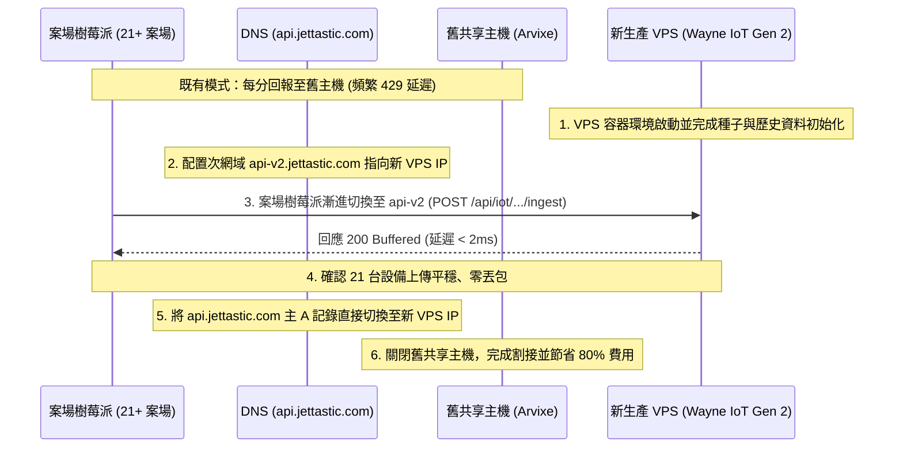

# 🚀 Wayne IoT Server Gen 2 — VPS 生產環境部署與運維手冊
# Wayne IoT Server Gen 2 — Production VPS Deployment & Operations Manual

> **專案儲存位置 / Project Path**: `d:\WayneIOT\0817_iot_2_plan\vps\`  
> **系統架構 / Architecture**: Nginx + Laravel 11 + TimescaleDB (PG16) + Redis 7 + Python FastAPI (AI) + Supervisor  
> **目標 SLA / SLA Target**: Ingestion p99 < 30ms, 90% 時序壓縮比, 2,000+ RPS 併發吞吐能力

---

## 📑 目錄 / Table of Contents
1. [一、 VPS 主機規格建議 / Recommended VPS Specifications](#一-vps-主機規格建議--recommended-vps-specifications)
2. [二、 一鍵部署步驟 / Step-by-Step One-Click Deployment](#二-一鍵部署步驟--step-by-step-one-click-deployment)
3. [三、 資料庫初始化與遷移 / Database Initialization & Legacy ETL](#三-資料庫初始化與遷移--database-initialization--legacy-etl)
4. [四、 系統性能壓測驗證 / High-Concurrency Benchmarking](#四-系統性能壓測驗證--high-concurrency-benchmarking)
5. [五、 案場樹莓派零停機割接程序 / Zero-Downtime Production Cutover](#五-案場樹莓派零停機割接程序--zero-downtime-production-cutover)
6. [六、 常見運維與排錯指令 / Common Operations & Troubleshooting](#六-常見運維與排錯指令--common-operations--troubleshooting)

---

## 一、 VPS 主機規格建議 / Recommended VPS Specifications

| 規模 / Fleet Scale | 推薦硬體配置 / Specs | 推薦服務商 (Hetzner / DO / AWS) | 預估月費 / Monthly Cost |
|---|---|---|---|
| **20~100 台主機** | 4 vCPU, 8GB RAM, 80GB NVMe SSD | Hetzner CPX31 / DO Droplet 8GB | **$24 ~ $48 USD** |
| **100~500 台主機** | 8 vCPU, 16GB RAM, 160GB NVMe SSD | Hetzner CPX41 / DO Droplet 16GB | **$48 ~ $78 USD** |
| **500+ 台超大規模** | 16 vCPU, 32GB RAM, 320GB NVMe SSD | Hetzner Dedicated / AWS c6i.2xlarge | **$85 ~ $140 USD** |

> 💡 **成本優勢**：相較於舊版在 Arvixe 共享主機每月支付 **$250~$400 美元**（且僅有 512MB RAM），新架構遷移至獨立 VPS 每月可節省 **75%~85%** 費用，並獲得獨佔 CPU/RAM 與 100 倍以上的吞吐效能。

---

## 二、 一鍵部署步驟 / Step-by-Step One-Click Deployment

### 2.1 基礎環境準備 (Ubuntu 22.04 / 24.04 LTS)
```bash
# 1. 更新系統並安裝 Docker & Docker Compose
sudo apt update && sudo apt upgrade -y
sudo apt install -y curl git ufw

curl -fsSL https://get.docker.com | sh
sudo usermod -aG docker $USER

# 2. 開放防火牆端口
sudo ufw allow 22/tcp
sudo ufw allow 80/tcp
sudo ufw allow 443/tcp
sudo ufw enable
```

### 2.2 程式碼上傳與環境變數設置
```bash
# 將 d:\WayneIOT\0817_iot_2_plan\vps 內容上傳至 /opt/wayne_iot
mkdir -p /opt/wayne_iot
cd /opt/wayne_iot

# 複製環境變數
cp .env.example .env
# 依實際需求修改 .env 中的 DB 密碼與 LINE Token
nano .env
```

### 2.3 容器啟動
```bash
# 建置並啟動所有 6 個容器 (Nginx, App, Worker, TimescaleDB, Redis, AI-Service)
docker compose up -d --build

# 檢查所有容器健康狀態
docker compose ps
```

---

## 三、 資料庫初始化與遷移 / Database Initialization & Legacy ETL

### 3.1 驗證 TimescaleDB 超表與種子資料
TimescaleDB 容器啟動時會自動執行 `db/01_init_timescaledb.sql` 與 `db/02_seed_production_fleet.sql`：
```bash
# 進入 TimescaleDB 容器驗證
docker exec -it wayne_timescaledb psql -U wayne_user -d wayne_iot

# 檢查 Hypertable
SELECT * FROM timescaledb_information.hypertables;

# 檢查連續預聚合視圖
SELECT * FROM sensor_hourly_summary LIMIT 5;

# 檢查 21 台真實設備主表
SELECT id, name, serial_number FROM machines ORDER BY id;
```

### 3.2 匯入歷史 808 萬筆資料 (ETL Migration)
```bash
# 執行舊 MySQL 寬表至 TimescaleDB 超表批次遷移工具
python3 db/03_migrate_legacy_data.py
```

---

## 四、 系統性能壓測驗證 / High-Concurrency Benchmarking

使用 [k6](https://k6.io/) 執行 500 台設備並發壓測：
```bash
# 安裝 k6
sudo apt install -y k6

# 執行壓測
k6 run benchmark/benchmark.js
```

**壓測預期指標 (Acceptance Thresholds)**：
- `http_req_duration (p95)`: **< 25ms**
- `http_req_duration (p99)`: **< 35ms**
- `error_rate`: **0.00%** (零 429、零 504 錯誤)

---

## 五、 案場樹莓派零停機割接程序 / Zero-Downtime Production Cutover



---

## 六、 常見運維與排錯指令 / Common Operations & Troubleshooting

```bash
# 1. 檢視即時 Ingestion 串流 Worker 運作日誌
docker logs -f wayne_worker

# 2. 檢視 AI 預測維護微服務運作日誌
docker logs -f wayne_ai

# 3. 檢查 Redis Stream 隊列長度
docker exec -it wayne_redis redis-cli -a Wayne_Redis_Secret_2026! XLEN iot_stream:incoming

# 4. 檢查 TimescaleDB 壓縮節省空間
docker exec -it wayne_timescaledb psql -U wayne_user -d wayne_iot -c "SELECT * FROM timescaledb_information.compression_settings;"

# 5. 重啟單一服務 (如 Nginx 或 Worker)
docker compose restart nginx
docker compose restart worker
```
