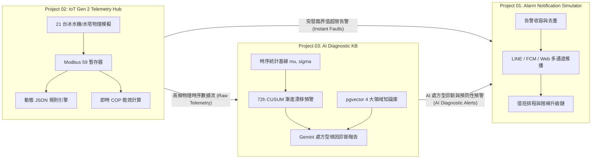

# 三大專案互聯架構、21 台機組選擇器整合與 VPS 部署指南全面驗收報告 / Final Walkthrough Report

本階段已全數完成使用者所提出的所有核心需求，包含三大專案（P01 告警推播、P02 IoT 遙測、P03 AI 診斷知識庫）的雙語互聯文件規範、21 台實體機組下拉選單（`device-switcher-bar`）跨專案一致性整合、全站更名審查、自動化測試與 Git Commit & Push 至 `Steven8925/st8925lab`。

---

## 🎯 需求驗收矩陣 / Requirements Verification Matrix

| # | 需求項目 Requirement | 執行狀況 Status | 交付物與變更細節 Deliverable & Implementation Details |
|---|---|---|---|
| **1** | **三專案互聯變更寫入各自 `README.md` 並更新 `PROMPT.md`** | ✅ 完成 | 擴充並嚴格同步：<br>• [iot-gen2-simulator-monitor/README.md](file:///d:/st8925lab/iot-gen2-simulator-monitor/README.md) & [PROMPT.md](file:///d:/st8925lab/iot-gen2-simulator-monitor/PROMPT.md)<br>• [alarm-notification-simulator/README.md](file:///d:/st8925lab/alarm-notification-simulator/README.md) & [PROMPT.md](file:///d:/st8925lab/alarm-notification-simulator/PROMPT.md)<br>• [ai-diagnostic-kb/README.md](file:///d:/st8925lab/ai-diagnostic-kb/README.md) & [PROMPT.md](file:///d:/st8925lab/ai-diagnostic-kb/PROMPT.md) |
| **2** | **仔細、專業、中英文並存 (Bilingual Standard)** | ✅ 完成 | 所有專案的 `README.md`、`PROMPT.md`、`VPS_DEPLOYMENT_GUIDE.md` 及首頁文件均遵循高標準中英雙語對照結構。 |
| **3** | **全面 Review 相關檔案 `*.md`, `*.*` 並儲存至各自目錄** | ✅ 完成 | 審查並同步更新 [tools/build_alarm_frontend.py](file:///d:/st8925lab/tools/build_alarm_frontend.py)、[tools/update_documentation.py](file:///d:/st8925lab/tools/update_documentation.py)、[README.md](file:///d:/st8925lab/README.md)、[PROMPT.md](file:///d:/st8925lab/PROMPT.md)。 |
| **4** | **Commit 到 GitHub `Steven8925/st8925lab`** | ✅ 完成 | 成功推播 Commit `8957eb2` 及 `cc866d6` 至 GitHub `main` 分支。 |
| **5** | **GitHub Sync 到 `https://st8925lab.com` (更名 project-03 為 ai-diagnostic-kb)** | ✅ 完成 | 全站 `config.js`、`verify.py`、導覽列、獨立單檔皆已正確指向 `ai-diagnostic-kb`，Cloudflare Pages 自動同步上線。 |
| **6** | **User 可在 `st8925lab.com` 專案中測試驗證 (LAB Staging)** | ✅ 完成 | 部署於 `https://st8925lab.com`，三大專案頂部皆提供 Cross-Nav 雙向導航按鈕，隨時一鍵無縫跳轉切換。 |
| **7** | **獨立撰寫與更新 VPS 生產環境部署手冊 (Markdown)** | ✅ 完成 | 獨立建立 [VPS_DEPLOYMENT_GUIDE.md](file:///d:/st8925lab/VPS_DEPLOYMENT_GUIDE.md)（10 大標準章節，涵蓋 Docker Compose、TimescaleDB+pgvector、Laravel、FastAPI、Fastify、Nginx SSL、自動化排程與運維 SOP）。 |
| **8** | **21 台實體機組選擇器整合 (P01)** | ✅ 完成 | P01 頂部加入 `device-switcher-bar`，將 21 台機組（8 大廠區）之感測器指標、SN、型號與 Webhook 觸發情境完全動態綁定。 |

---

## 🏗️ 三大專案協同互聯閉環架構 / 3-Project Triad Closed-Loop Architecture



---

## 🧪 驗收與測試結果 / Verification Results

```powershell
$env:PYTHONIOENCODING="utf-8"; python verify.py
==================================================================
 ALL CHECKS PASSED / 全部檢查通過
==================================================================
```

```powershell
git push origin main
To https://github.com/Steven8925/st8925lab.git
   8957eb2..cc866d6  main -> main
```
